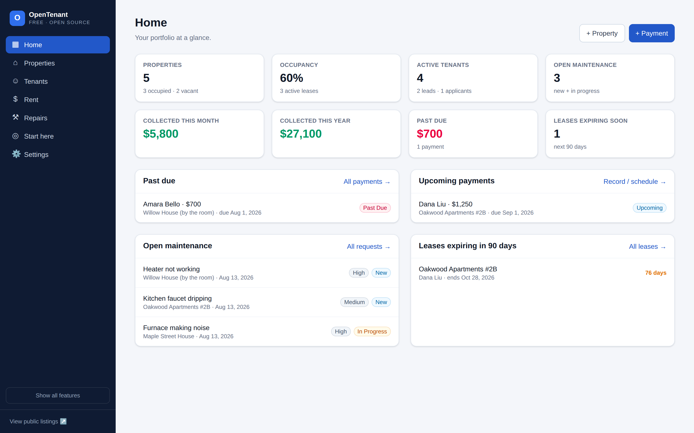
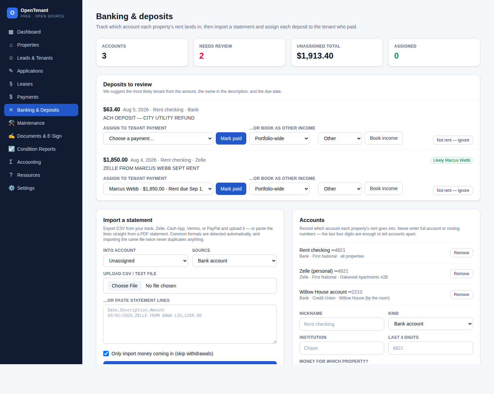
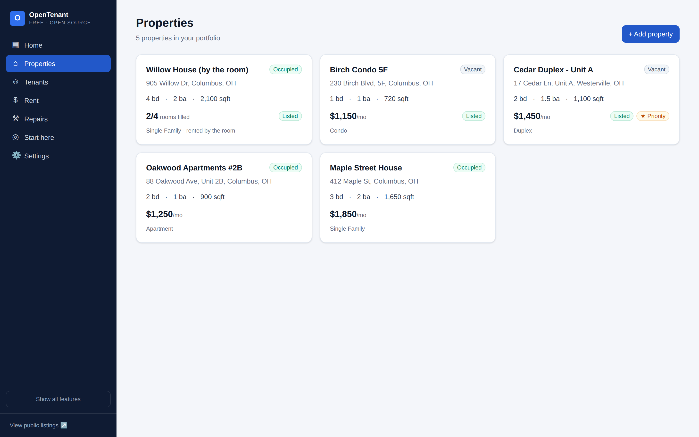
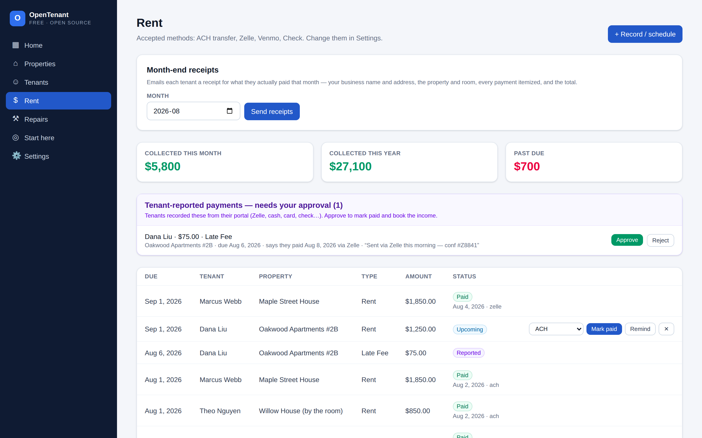
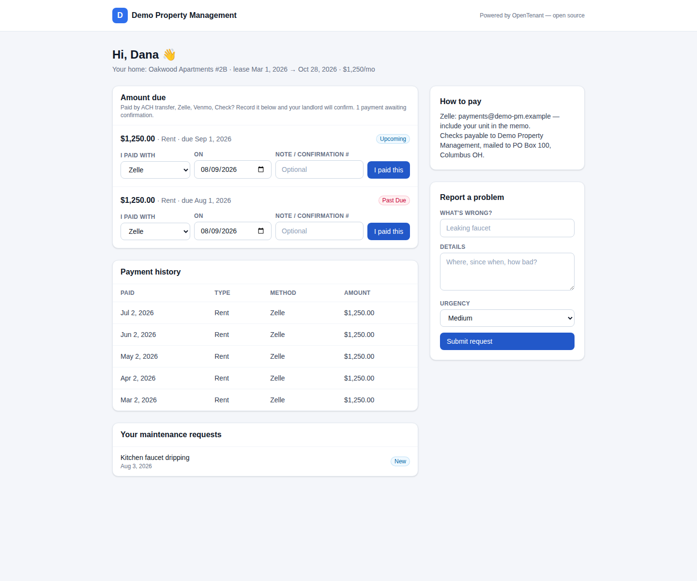
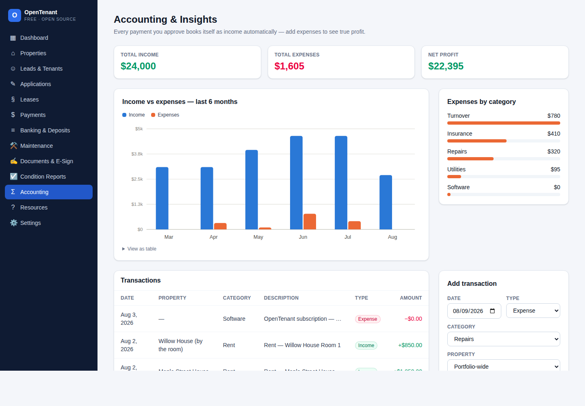
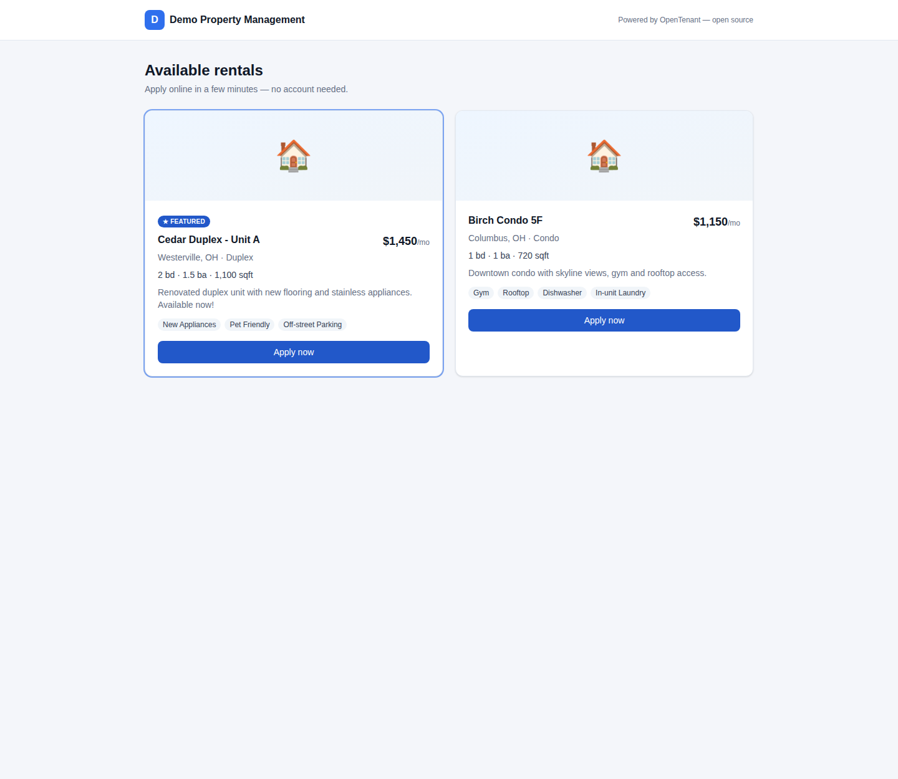
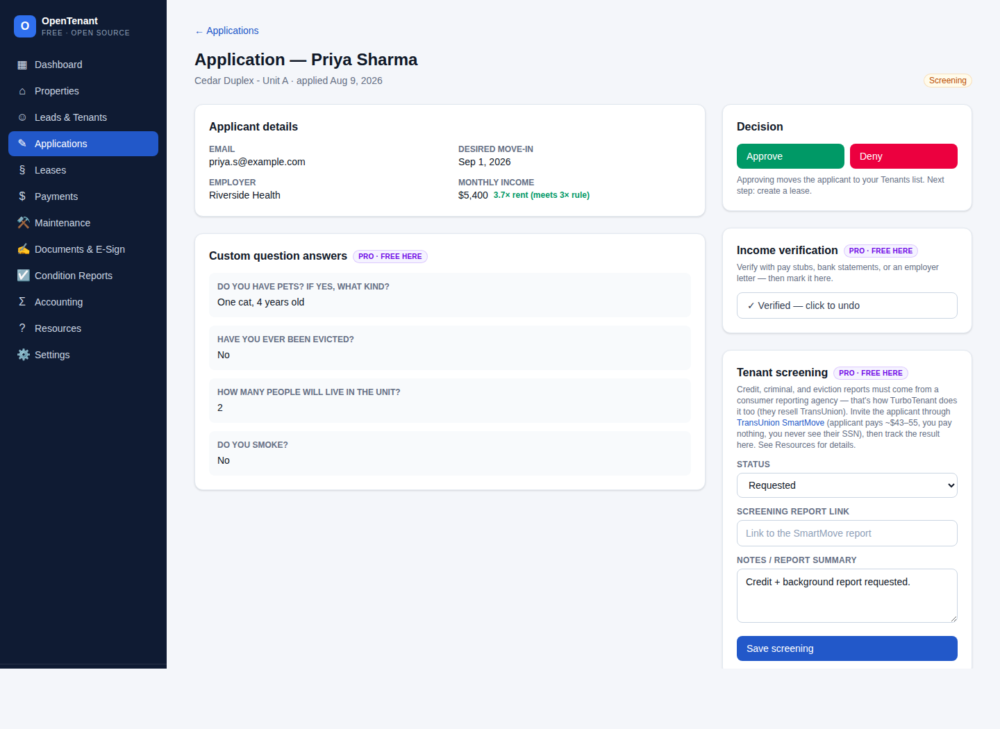
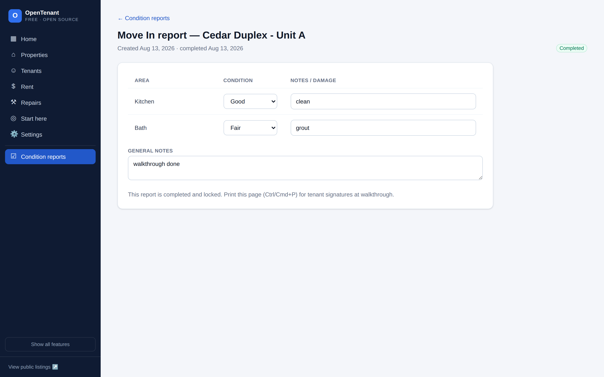

# OpenTenant 🏠

**Free, open-source property management for landlords.**

Listings, applications, screening, leases, rent collection, maintenance, and accounting —
self-hosted, with no subscription and no cut taken from rent. Your data stays on your own
machine, in a database you control.



## Features

| Module | What it does |
|---|---|
| **Dashboard** | Occupancy, active tenants & leases, collected this month/year, past due, open maintenance, expiring leases |
| **Properties** | Full property records with rent, deposit, amenities, and listing controls — plus **address autocomplete** that fills city, state, and ZIP |
| **Rent by the room** | Rent a house room by room: each room has its own rent, deposit, tenant, lease, and listing |
| **Public listings** | A marketing page (`/listings`) with online applications; vacant rooms list individually, and featured properties pin to the top |
| **Leads & Tenants** | Pipeline from lead → applicant → tenant → past tenant, with one-click stage moves |
| **Applications** | Online applications with **custom questions**, an automatic income-to-rent check, and income verification |
| **Tenant screening** | Track credit/criminal/eviction screening through any FCRA bureau — the applicant pays, you pay nothing ([how it works](docs/HOW-IT-WORKS.md)) |
| **Leases & e-signing** | Generates a complete, printable lease from your data, then sends it for signature through [OpenSign](https://www.opensignlabs.com) — free self-hosted, with optional API automation |
| **Payments** | Schedule rent up to 24 months ahead, accept any method (Zelle, ACH, card, cash, check), automatic past-due tracking |
| **Banking & Deposits** | Record which account each property's rent lands in, **import bank/Zelle/Cash App statements**, and assign each deposit to the tenant who paid — auto-suggested by amount, name, and due date |
| **Tenant portal** | Private per-tenant link: balance due, **"I paid this"** reporting (you approve), payment history, maintenance requests |
| **Maintenance** | Requests with priority and status workflow, from tenants or you |
| **Documents & E-Sign** | Track documents through signing via open-source tools ([Documenso](https://documenso.com), [DocuSeal](https://www.docuseal.com), [OpenSign](https://www.opensignlabs.com)) |
| **Condition reports** | 12-area move-in/move-out checklists that lock when completed |
| **Accounting & Insights** | Approved payments auto-book as income; expenses by category; income-vs-expense chart; net profit |
| **Email notifications** | Connect Gmail (or any SMTP) and the app confirms applications, alerts you to new ones, sends approval/denial notices, rent reminders, payment receipts, portal invites, and maintenance updates |
| **Resources** | Built-in guides for screening, rent collection, room rentals, and reconciliation |

## Screenshots

| | |
|---|---|
| **Banking & Deposits** — import a statement, and each deposit is matched to the tenant who paid  | **Rent by the room** — each room has its own rent, tenant, and listing  |
| **Payments** — tenant-reported payments queue for one-click approval  | **Tenant portal** — balance due, "I paid this", history, maintenance  |
| **Accounting** — income vs expenses, categories, net profit  | **Public listings** — whole homes and single rooms, apply online  |
| **Application review** — income check, verification, screening  | **Condition reports** — move-in/move-out checklists  |

## Quick start

Requires **Node.js ≥ 22.13**. The PocketBase database binary installs through npm, so there is
nothing else to download.

```bash
git clone https://github.com/Shionjee7/Open-Tentant.git
cd Open-Tentant
npm run setup
```

That installs dependencies, builds, starts the database, and serves the app. Open
http://localhost:3000 and click **Load demo data** to explore every module with sample records,
or add your first property and start clean.

For day-to-day development, run `npm run pb` in one terminal and `npm run dev` in another.
Everything lives in `data/pb_data/` — back up that folder and you've backed up everything. The
database console is at http://127.0.0.1:8090/_/.

## Deploy it (get a real URL)

See **[docs/DEPLOY.md](docs/DEPLOY.md)** for Render (one-click blueprint included), Railway,
Fly.io, and plain Docker. Two things matter wherever you host it:

- **Turn on a login gate** — either `ADMIN_PASSWORD` (a shared password) or Google sign-in
  (below). Without one, the app runs open, which is fine on your laptop and *not* fine on a
  public URL.
- **Mount a persistent volume and point `DATA_DIR` at it** (e.g. `DATA_DIR=/var/data`) so
  your data survives restarts.

With Docker on any server you own:

```bash
ADMIN_PASSWORD="a-long-random-password" docker compose up -d
```

### Signing in with Google

1. In the [Google Cloud Console](https://console.cloud.google.com/apis/credentials), create an
   OAuth client (type: **Web application**).
2. Add the authorized redirect URI: `https://your-domain.com/api/auth/google/callback`
3. Set `GOOGLE_CLIENT_ID`, `GOOGLE_CLIENT_SECRET`, and `GOOGLE_ALLOWED_EMAILS`, then restart.

Only the emails in `GOOGLE_ALLOWED_EMAILS` can get in — having a valid Google account is not
enough by itself. Settings → **Sign-in & security** shows whether the gate is actually on.

### Who can reach what

| Route | Access |
|---|---|
| `/`, `/properties`, `/payments`, `/banking`, … | You — sign-in required |
| `/listings`, `/apply/[id]` | Public, by design (prospects browse and apply) |
| `/portal/[token]` | The tenant holding that unguessable link |

## Configuration

Every setting is optional — the app runs with none of them.

| Variable | What it does |
|---|---|
| `ADMIN_PASSWORD` | Shared-password login. Either this or Google sign-in is required for any public deployment. |
| `GOOGLE_CLIENT_ID` / `GOOGLE_CLIENT_SECRET` | Google sign-in credentials from the Google Cloud Console. |
| `GOOGLE_ALLOWED_EMAILS` | Comma-separated emails allowed to sign in with Google. Required — no allowlist, no Google access. |
| `AUTH_SECRET` | Signs session cookies. Set it on any real deployment. |
| `DATA_DIR` | Where the database lives. Point at your mounted volume. |
| `PB_ADMIN_PASSWORD` | Database console password. Change it on any shared machine. |
| `PB_PORT` / `PB_URL` | Where PocketBase listens / how the app reaches it. |
| `PORT` | Port to listen on (default 3000). |
| `GEOCODER_URL` | Your own Nominatim/Photon instance for address autocomplete. |
| `GEOCODER_CONTACT` | Contact string sent with geocoding requests. |
| `APP_URL` | Public address, used for links inside emails. |
| `SMTP_HOST` / `SMTP_PORT` / `SMTP_USER` / `SMTP_PASSWORD` | Email account. Also settable in Settings. |
| `SMTP_FROM_NAME` / `SMTP_FROM_EMAIL` / `SMTP_NOTIFY_EMAIL` | Sender identity and where your alerts go. |

## Tech stack

- [Next.js 15](https://nextjs.org) (App Router, Server Components + Server Actions)
- [Tailwind CSS 4](https://tailwindcss.com)
- [PocketBase](https://github.com/pocketbase/pocketbase) (MIT) — database, REST API, and admin
  console, running as its own process with SQLite storage
- TypeScript

Everything it depends on is free and open source. Schema changes migrate automatically on
startup, so upgrading is `git pull` with no manual steps.

## Roadmap

- [ ] Per-user roles (today every signed-in account has full access)
- [ ] Optional Stripe integration for in-app card & ACH payments
- [ ] Direct e-sign API integration instead of pasted links
- [ ] File uploads in the UI (the collections already accept them)
- [ ] Native PDF statement parsing (today: paste the text, or import CSV)
- [ ] Listing syndication feeds
- [ ] Rent reporting to credit bureaus

Contributions welcome — this project exists so no landlord has to pay rent on their own
software.

## License

[MIT](LICENSE) — use it, change it, sell it, just keep the copyright notice.

Third-party licenses and attribution are documented in [NOTICE.md](NOTICE.md). Short
version: every bundled dependency is permissively licensed, and the AGPL e-signature tools
are separate services OpenTenant talks to over the network rather than code it includes —
so publishing this under MIT is fine.
